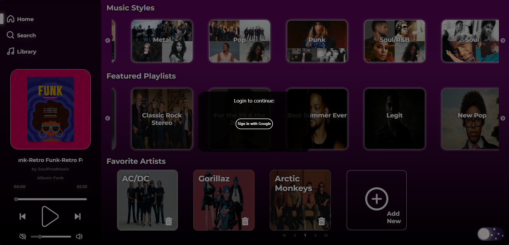
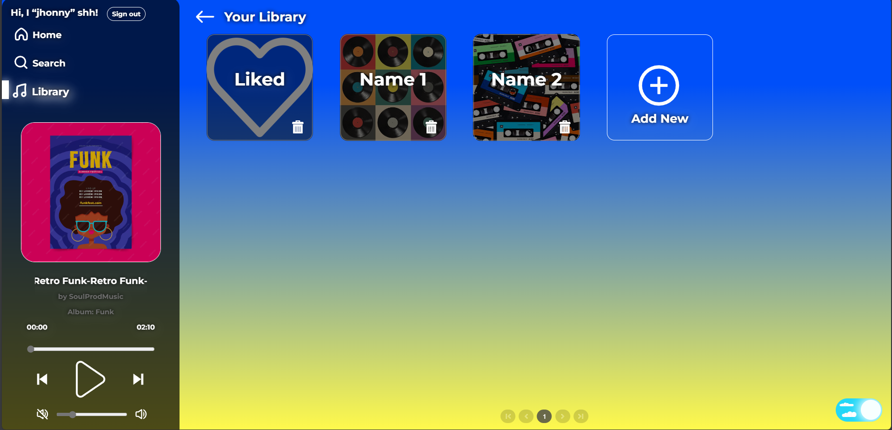
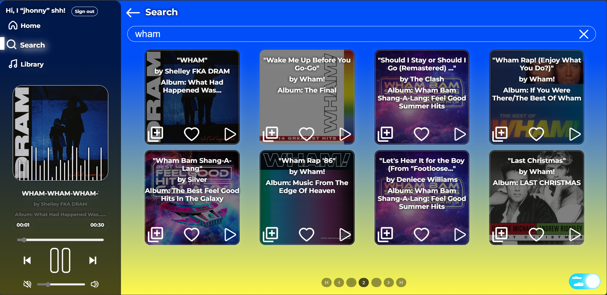

## Music Player

### Description

The **Music Player** project is a web application that allows users to listen to their favorite music tracks. It provides a user-friendly interface for managing playlists, searching for songs, and enjoying music seamlessly. It consists of three main pages: **"Home"**, **"Search"**, and **"Library"**. Each of these pages has unique functionalities that allow users to conveniently manage their music.

### Main features

- **Playlists**: Create and manage personalized playlists.
- **Search**: Easily search for songs by title, artist, or album.
- **Audio Controls**: Play, pause, skip, and adjust volume.

### Home Page

**Music Styles**: Displays various music genres fetched from the Napster API.
**Recommended Playlists**: Shows curated playlists also fetched from the Napster API.
**Favorite Artists**: Managed using Redux state, users can add new artists to this list by using the AddNew component. A modal window opens for searching artists via the Napster API, and users can add artists to their list by clicking on a circle, which plays a sound upon addition.

### Search Page

**Track Search**: Users can search for tracks by any attribute, and all matching results will be loaded onto the page. Tracks can be added to the library, liked, or played directly.

### Library Page

**Track Libraries**: Users can view, add, or delete their music libraries. Clicking on any library loads its tracks, which can be played or removed.

---

### Additional Features

- **User Authentication**: Upon launching the app, a modal window prompts users to log in using their Google account via Firebase for a secure and convenient login process.
- **User Profile**: Information about the user and a logout button are displayed on the left side of the page, accessible by clicking the user's name.
- **Music Player**: A persistent player on the left side of the page allows for easy music control.
- **Dark and Light Themes**: Users can switch between dark and light themes using a slider button at the bottom right of the page.

### Technology Stack

- **React**: For building the user interface.
- **react-use-audio-player**: For managing audio files in the browser using React hooks, based on the reliable "howler.js" library.
- **Napster API**: For fetching music genres and playlists.
- **Firebase**: For user authentication and login.
- **Redux**: For managing the state of the favorite artists list.

### Installation

1. Clone the repository:

   ```
   git clone https://github.com/I0shem/musicplayer.git
   ```

2. Install dependencies:

   ```
   cd musicplayer
   npm install
   ```

3. Start the development server:
   ```
   npm start
   ```

### Usage

1. Open the app in your browser (default: http://localhost:3000).
2. Browse through the music library.
3. Create playlists and add your favorite tracks.
4. Enjoy the music!

### Screenshots





### Contributing

Contributions are welcome! If you'd like to improve the app or fix any issues, feel free to submit a pull request.

### License

This project is licensed under the MIT License. See [LICENSE](./LICENSE) for details.

### Contact

For any questions or feedback, reach out to me via email: [i.i.shemeta@gmail.com](mailto:your@email.com).
